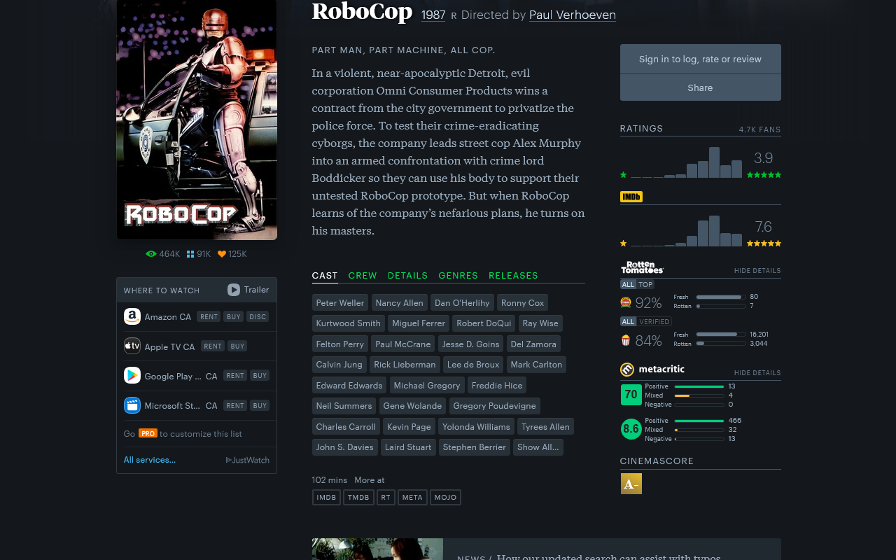

# Letterboxd-Extras

A browser add-on/extension that adds additional features to the movie tracking database site [Letterboxd](https://letterboxd.com/) including ratings from other sites, box office and budget, and more.

**This add-on also supports the mobile Letterboxd website and has been tested to work on Firefox for Android.** Other Android browsers that support add-ons/extensions should work, but have not been tested.

## Features
- Film ratings: displays film ratings from other websites, by default:
  - IMDb
  - Rotten Tomatoes
  - Metacritic
  - MyAnimeList
  - AniList
  - CinemaScore
- Additional film rating sites, disabled by default:
  - SensCritique
  - MUBI
  - FilmAffinity
  - Simkl
  - AlloCiné
- Additional top film rankings: Display the rankings from "They Shoot Pictures, Don't They?" top 1000 and "BFI Sight and Sound" top 250
- Info box on people pages: A Wikipedia-like info box on people pages for the birth dates, death dates, and years active
- MPA film ratings: Display the film's MPA rating 
- Wide release date: Display the full wide release date on hover of the film year
- Duration: Converts the duration to hours and minutes on hover of the duration
- Budget and Box Office: Display budget and box office numbers in the details tabs
- Search: option to default the search to filter to films only

## Installation
### Firefox
[Firefox Add-ons](https://addons.mozilla.org/en-US/firefox/addon/letterboxd-extras/)

XPI file for manual installation available for each release on the [releases tab](https://github.com/duncanlang/Letterboxd-Extras/releases).

### Chromium
[Chrome Web Store](https://chromewebstore.google.com/detail/letterboxd-extras/edhldpamlnkpekapihiolppcdppgeice)

[Edge Add-ons](https://microsoftedge.microsoft.com/addons/detail/letterboxd-extras/khnodkkceaakcafenlmnbbjgfkhjmbgh)

## Issues or Suggestions
Any issues or suggestions, please [create an issue on Github](https://github.com/duncanlang/Letterboxd-Extras/issues).

Any suggestion for new rating sites will be considered, but may not be possible due to lack of APIs or anti-scraping rules.

## Screenshots
Additional ratings from IMDb, Rotten Tomatoes, Metacritic, and Cinemascore in the sidebar, new links at the bottom, MPA rating at the top

Extra details for Rotten Tomatoes and Metacritic expanded in the sidebar

More ratings from SensCritique, MUBI, filmaffinity, and SIMKL, rankings on the left sidebar, and budget and box office in the details tab

More ratings from Allocine

MyAnimeList and AniList ratings for Anime

Info box below photo of the actor, displaying the birth and death dates as well as the years active

